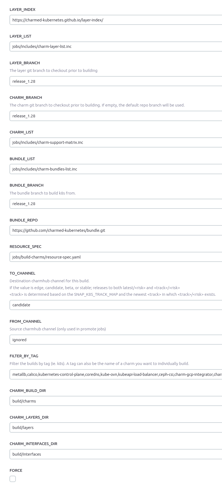

# Creating a bugfix release
Performs a Kubernetes bugfix release, which includes validation across the base
deployment as well as variations including calico, tigera, vault, nvidia, and
ceph.

## Bugfix Release Process

### Repository layout

All charm repositories used by charmed-kuberentes use a common branch scheme to provide a
consistent experience across all code bases. Any external or shared repositories are forked
into the charmed-kubernetes namespace and have the common branches added.

Branches:
 * `main`: The primary development branch. Merges are made against this branch as they are
   approved.
 * `release_x.xx`: is the release branch. Major release have `main` directly merged to
   `release_x.xx` while bug-fix releases have specific commits cherry-picked onto 
   `release_x.xx` to create a release.

Tags are used to mark the bug-fix releases on the `release_x.xx` branch.

Snap repositories follow a similar branching model with a slightly different name. 
Instead each channel has a release branch `release/<channel>` which serves the same purpose
of release tracking as the `release_x.xx` branch on charm repositories.

### Preparing the release branch

All Kubernetes charms, interfaces, and layers are revisioned together via
[milestones][milestones]. To release a bug-fix milestone all bugs listed for the milestone
will need to have their pull requests cherry-picked onto the stable branch (or onto the
release branch in the case of snaps). 

#### Easier PR tracking via LP Tags

To make this process easier to track, you can use tags and an advanced search in LP.

Start by bugging Tim until he runs a magic script to add the "backport-needed" tag to all bugs
listed in the milestone. Next setup the following bookmarklet in your browser:

```
javascript:var milestone = prompt("Milestone (e.g., 1.19+ck1)"); document.getElementsByName('field.milestone:list').forEach(input => { if(input.id.includes(milestone)) input.checked = true })
```

Use the bookmarklet on the [advanced search][advanced-search] page for charmed-kubernetes
bugs and you can easily select the milestone you are working on. Add the "backport-needed"
tag to the search results and you will have a list of bugs included in the milestone. As you
work through the cherry-picks needed for each bug, removing the "backport-needed" tag will
remove it from the search.

### Performing the cherry-pick

For each bug, review the comments and cherry-pick all pull requests onto the stable or
release branch in the source repository. Some bugs will require doing this for multiple
source repositories be sure to get all pull requests listed in the bug. As you complete all
cherry-picks for a given bug remove the "backport-needed" tag. You can push to the stable
branch as you complete each cherry-pick, release won't happen automatically even if you do
not complete the process in a single sitting.

If there are trivial merge conflicts you can fix them and continue. If there is a merge
conflict which is not trivial you can create a PR and ask another team member to review.

When all bugs in the milestone are done you are ready to proceed. The release process will
automatically detect changes in interfaces and layers, if a bug fixes a layer or interface
you do not need to try and find which charms are affected by the change.

### Document release notes

Create a PR against the [docs repo][] with release notes including:

- Bugfixes
- Enhancements
- Known Limitations/Issues

[docs repo]: https://github.com/charmed-kubernetes/kubernetes-docs

### Tag existing stable branches with bugfix release tag

**Job**: https://jenkins.canonical.com/k8s/job/sync-stable-tag-bugfix-rev/

This will tag all repos with the k8s version and bugfix revision
associated, for example, the first bugfix release of 1.24 would be
**1.24+ck1** based on the tip of the `release_1.24` branch

#### Charm tag options


### Run the **build-charms** job

**Job**: https://jenkins.canonical.com/k8s/job/build-charms/

This will build and promote the stable charms to candidate channel for testing.

#### Charm build options



### Verify Commit SHAs of charms/layers/interfaces

Verify the charm manifests for the build charms matches the commit SHAs of
the stable branches of what was built in the previous build-charms job.

### Build cdk-addons

Run build jobs for n, n-1, and n-2 versions of cdk-addons. For example, if
doing a 1.22+ckX release, then you would run:

* build-release-cdk-addons-amd64-1.22
* build-release-cdk-addons-amd64-1.21
* build-release-cdk-addons-amd64-1.20

### Required Testing

#### Run **validate-charm-bugfix** job

**Job**: https://jenkins.canonical.com/k8s/job/validate-charm-bugfix/

This validates the deployment using the charms from candidate channel.

#### Run **validate-charm-bugfix-upgrade** job

**Job**: https://jenkins.canonical.com/k8s/job/validate-charm-bugfix-upgrade/

This validates the deployment using the charms from stable channel, then upgrading 
the charms to the candidate channel.

#### Examine Results

**Results** http://jenkaas.s3-website-us-east-1.amazonaws.com/

Verify that the tests are passing among all the permutations which the above jobs
created.  Adjust the tests or charms for any failures, retagging and rebuilding
from the release-* branches when changes are necessary.

### Promote charms from **release/candidate** to **stable**

**Job**: https://jenkins.canonical.com/k8s/job/promote-charms/

This job takes a tag, from_channel, and to_channel. The tag defaults to `k8s,k8s-operator` so
it will only promote the necessary charms that make up charmed-kuberneetes.

**Note about `to_channel`**

If this is a bugfix for the current latest/stable release 

`ex) 1.26 is the latest release, and this is a bug fix for 1.26`
* set the `to_channel` = `stable`
* the charms will be released to both `latest/stable` and `1.26/stable`

If this is a bugfix for a prior release 

`ex) 1.27 is the latest release, but this release is a bug fix for 1.26+ckN`
* set the `to_channel` = `1.26/stable`
* the charms will be released to only `1.26/stable`

### Build stable bundles

**Job**: https://jenkins.canonical.com/k8s/job/build-charms/

bundles shouldn't be promoted because a candidate bundle points to candidate channel charms.  Instead rebuild the bundles targetting
the correct `to_channel`.  It's also entirely possible this does
not result in a new bundle at all, if the source of the bundles
themselves haven't changed through the course of the `ckN` release.

**Note about `to_channel`**

If this is a bugfix for the current latest/stable release 

`ex) 1.26 is the latest release, and this is a bug fix for 1.26`
* set the `to_channel` = `stable`
* the bundles will be released to both `latest/stable` and `1.26/stable`

If this is a bugfix for a prior release 

`ex) 1.27 is the latest release, but this release is a bug fix for 1.26+ckN`
* set the `to_channel` = `1.26/stable`
* the bundles will be released to only `1.26/stable`


Run the build with parameters:
  * layer_branch = release_1.XX
  * charm_branch = release_1.XX
  * bundle_branch = release_1.XX
  * to_channel = `see-note-above`
  * filter_by_tag = charmed-kubernetes

Repeat the build with parameters:
  * layer_branch = release_1.XX
  * charm_branch = release_1.XX
  * bundle_branch = release_1.XX
  * to_channel = `see-note-above`
  * filter_by_tag = kubernetes-core

### Promote cdk-addons

Promote **cdk-addons** snaps from candidate to stable for n, n-1, and n-2
tracks. For example, if doing a 1.22+ckX release, then you would promote:

* 1.22/candidate -> 1.22/stable
* 1.21/candidate -> 1.21/stable
* 1.20/candidate -> 1.20/stable

This could be done using the following one-liner:

```
for track in 1.22 1.21 1.20; do for rev in `snapcraft revisions cdk-addons | grep "$track/candidate\*" | cut -d ' ' -f 1`; do snapcraft release cdk-addons "$rev" "$track/stable"; done; done
```

### Close the milestone

From the [cdk-scripts repo](https://github.com/canonical/cdk-scripts), run the
close-milestone.py script. For example:

```
./close-milestone.py 1.22+ck1
```

### Send announcement to k8s-crew with any relevant information.

[milestones]: https://launchpad.net/charmed-kubernetes/+milestones
[advanced-search]: https://bugs.launchpad.net/charmed-kubernetes/+bugs?advanced=1
