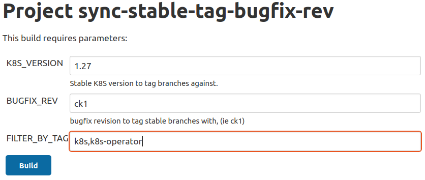

# Creating a bugfix release
This document outlines the process for publishing a Charmed Kubernetes bugfix release.

## Background

### Repository layout

All charm repositories used by Charmed Kuberentes have a common branch scheme to provide a
consistent experience across all code bases. Any external or shared repositories are forked
into the `charmed-kubernetes` github organization and have the following branches:

* `main`: The primary development branch. Merges are made against this branch as they are
  approved.
* `release_x.xx`: The release branch. Major releases have `main` directly merged to
  `release_x.xx`. Bugfix releases have specific commits cherry-picked to `release_x.xx`.

Tags are used to mark releases on the `release_x.xx` branch.

### Preparing the release milestone

All Charmed Kubernetes charms, interfaces, and layers are revisioned together via
[milestones][milestones]. To complete a bugfix release, all bugs listed for the
milestone will need to have their pull requests cherry-picked onto the appropriate
release branch.

#### Reconcile bugs

Determine which bugs will be included in this release and set their launchpad
milestone accordingly.

#### Setup the next milestone

Any milestone bugs that will not make it into this release should be moved to either
the next major (e.g. 1.28) or the next bugfix (e.g. 1.27+ck2) milestone.

If the next milestone does not exist, create it with the `create-milestone.py` script
found in the [cdk-scripts repo][cdk-scripts]. This will create a new milestone for
every launchpad project in the Charmed Kubernetes group. For example:
```
./create-milestone.py 1.27+ck2
```

### Performing the cherry-pick

For each milestone bug, review the comments and cherry-pick all pull requests onto the
appropriate `release_x.xx` branch. Some bugs will require doing this for multiple repos,
so be sure to get all pull requests listed in the bug.

After you complete all cherry-picks for a given bug, remove the "backport-needed" tag.
You can push to `release_x.xx` as you complete each cherry-pick; the release won't
happen automatically even if you do not complete this process in a single sitting.

If there are trivial merge conflicts, fix them and continue. If there are non-trivial
merge conflicts, create a PR and ask another team member to review.

When all bugs in the milestone are done, you are ready to proceed.

### Document release notes

Create a PR against the [docs repo][docs-repo] and
[ubuntu docs repo][ubuntu-docs-repo] with release notes including:

* Bugfixes
* Enhancements
* Known Limitations/Issues

These two PRs should be almost identical.
Note that you might need to fork the `ubuntu` repository to make the PR.

### Tag release branches with bugfix revision

**Job**: https://jenkins.canonical.com/k8s-ps5/job/sync-stable-tag-bugfix-rev/

This will tag `release_x.xx` branches for all charms that match the `FILTER_BY_TAG`
parameter with the k8s version and bugfix revision. For example, the first bugfix
release for 1.27 will tag the `release_1.27` branch with **1.27+ck1**.

#### Charm tag options



### Run the **build-charms** job

**Job**: https://jenkins.canonical.com/k8s-ps5/job/build-charms/

This will build charms from the `release_x.xx` branch and promote them to the
x.xx/candidate channel for testing.

#### Charm build options


### Ensure cdk-addons

Ensure cdk-addons `1.xx/candidate` channel matches the latest k8s release. If
it does not, run the `build-release-cdk-addons-amd64-1.xx` job.

As an example here both `kubelet` and `cdk-addons` snaps show
the same `1.31.5` in their `1.31/candidate`:

```bash
$ snap info kubelet | grep 1.31/candidate
> 1.31/candidate:   1.31.5         2025-01-16 (3503) 18MB classic

$ snap info cdk-addons | grep 1.31/candidate
> 1.31/candidate:   1.31.5  2025-01-17 (30236) 13MB -
```

### Required Testing

#### Confirm that recent builds are in the "latest/candidate" channel of charmhub

```bash
charms=(list of charm names)
for charm in ${charms[@]}; do
printf "Charm = %-30s Date = %s\n" $charm $(juju info $charm --channel=candidate | grep candidate | awk '{print $3}')
done
```

For instance if the list of charm names was:
```
charms=(metallb calico kubernetes-control-plane coredns kube-ovn kubeapi-load-balancer ceph-csi gcp-integrator aws-integrator vsphere-integrator)
```

Expected output should show all the charms recently up-to-date
```bash
Charm = metallb                        Date =            <-- this is missing
Charm = calico                         Date = 2023-09-22
Charm = kubernetes-control-plane       Date = 2023-09-22
Charm = coredns                        Date = 2023-06-07 <-- this is old
Charm = kube-ovn                       Date = 2023-09-22
Charm = kubeapi-load-balancer          Date = 2023-09-22
Charm = ceph-csi                       Date = 2023-09-22
Charm = gcp-integrator                 Date = 2023-09-22
Charm = aws-integrator                 Date = 2023-09-22
Charm = vsphere-integrator             Date = 2023-09-22
```

If not, confirm the build settings and rebuild until the correct charms and dates
appear in the output.

#### Run **validate-charm-bugfix**

**Job**: https://jenkins.canonical.com/k8s-ps5/job/validate-charm-bugfix/

This validates the deployment using the charms from the candidate channel.

#### Run **validate-charm-bugfix-upgrade**

**Job**: https://jenkins.canonical.com/k8s-ps5/job/validate-charm-bugfix-upgrade/

This deploys `charmed-kubernetes` from the stable channel, upgrades the charms to
the candidate channel, then validates the deployment.

#### Examine results

**Results**: http://jenkaas.s3-website-us-east-1.amazonaws.com/

Verify that the `validate-charm-bugfix-*` tests are passing. If failures occur:

* fix the broken test or charm in `main`
* cherry-pick charm fixes to the `release_x.xx` branch
* re-tag, re-build, and re-test per the above steps

### Promote charms from candidate to stable

**Job**: https://jenkins.canonical.com/k8s-ps5/job/promote-charms/

This job takes a tag, from_channel, and to_channel. The tag defaults to
`k8s,k8s-operator` to promote all charms that make up Charmed Kubernetes.

**Note: Only promote charms that were built by the *build-charms* job**

Otherwise, you would end up promoting charms from the last candidate release
overwriting the previous stable with an invalid charm.

It can be wise to run first with the `--dry-run` flag to ensure the correct
promotions are correct specifically for charms that require multiple promotions 
because they support multiple arches with potentially different resources.

**Note about `to_channel`**

If this is a bugfix for the current latest/stable release:

`ex) 1.27 is the current release, and this is a bugfix for 1.27`
* set the `from_channel` = `candidate`
* set the `to_channel` = `stable`
* the charms will be released to both `latest/stable` and `1.27/stable`

If this is a bugfix for a previous major release:

`ex) 1.27 is the current release, but this is a bugfix for 1.26`
* set the `from_channel` = `1.26/candidate`
* set the `to_channel` = `1.26/stable`
* the charms will be released to only `1.26/stable`

### Build stable bundles

**Job**: https://jenkins.canonical.com/k8s-ps5/job/build-charms/

Bundles reference specific charm channels at build time and should therefore
not be promoted. Instead, rebuild the bundles targetting the correct `to_channel`.
It's possible this does not result in a new bundle if the `bundle.yaml` hasn't
changed since the previous release.

**Note about `to_channel`**

If this is a bugfix for the current latest/stable release:

`ex) 1.27 is the latest release, and this is a bugfix for 1.27`
* set the `to_channel` = `stable`
* the bundles will be released to both `latest/stable` and `1.27/stable`

If this is a bugfix for a previous major release:

`ex) 1.27 is the latest release, but this is a bugfix for 1.26`
* set the `to_channel` = `1.26/stable`
* the bundles will be released to only `1.26/stable`

Run the job against needed bundles with the following:
  * layer_branch = release_x.xx
  * charm_branch = release_x.xx
  * bundle_branch = release_x.xx
  * to_channel = `see-note-above`
  * filter_by_tag = charmed-kubernetes,kubernetes-core

### Promote cdk-addons

Promote **cdk-addons** snaps from candidate to stable for n, n-1, and n-2
tracks. For example, if doing a 1.25+ckX release, then you would promote:

* 1.25/candidate -> 1.25/stable
* 1.24/candidate -> 1.24/stable
* 1.23/candidate -> 1.23/stable

This could be done using the following one-liner:
```
for track in 1.23 1.24 1.25; do for rev in `snapcraft revisions cdk-addons | grep "$track/candidate\*" | cut -d ' ' -f 1`; do snapcraft release cdk-addons "$rev" "$track/stable"; done; done
```

Also promote the n/candidate revision to latest/stable, for example:
```
for rev in `snapcraft revisions cdk-addons | grep "1.25/candidate\*" | cut -d ' ' -f 1`; do snapcraft release cdk-addons "$rev" "latest/stable"; done;
```

### Close the milestone

Run the `close-milestone.py` script found in the [cdk-scripts repo][cdk-scripts].
For example:
```
./close-milestone.py 1.25+ck1
```

### Send announcement to k8s-crew with any relevant information

Send an email to the `k8s-crew@lists.canonical.com` mailing list with something like the following information.
{VERSION} should be something like `1.31+ck1` and {CHANNEL} `1.31/stable`.

---

**Subject: Announcing the Release of Charmed Kubernetes {VERSION}**
 

We are excited to announce the release of Charmed Kubernetes {VERSION} in the {CHANNEL} channel!
This release includes several notable fixes and improvements across the Kubernetes charms, ensuring better stability, enhanced functionality, and improved security.

**Highlights of the Release:**

- **{CHARM}:**

  - {IMPROVEMENT_TITLE} ({LP_LINK})
  - ...

- ...


See the full release notes for details: {LINK_TO_RELEASE_NOTES}

We encourage you to upgrade and take advantage of the improvements. If you have any questions or encounter issues, please reach out via the mailing list or our support channels.

Thank you for using Charmed Kubernetes!

---


### References

[cdk-scripts]: https://github.com/canonical/cdk-scripts
[docs-repo]: https://github.com/charmed-kubernetes/kubernetes-docs
[ubuntu-docs-repo]: https://github.com/canonical/ubuntu.com/tree/main/templates/kubernetes/docs
[milestones]: https://launchpad.net/charmed-kubernetes/+milestones
