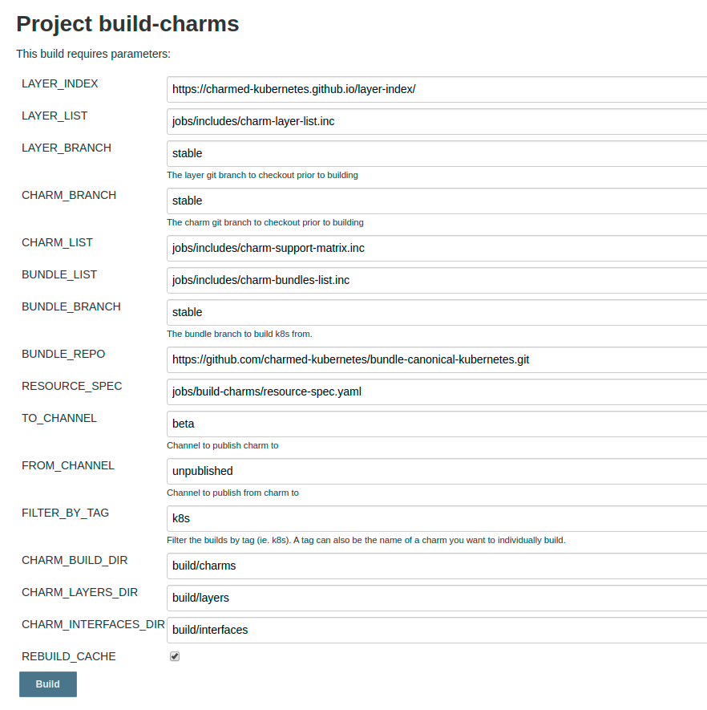
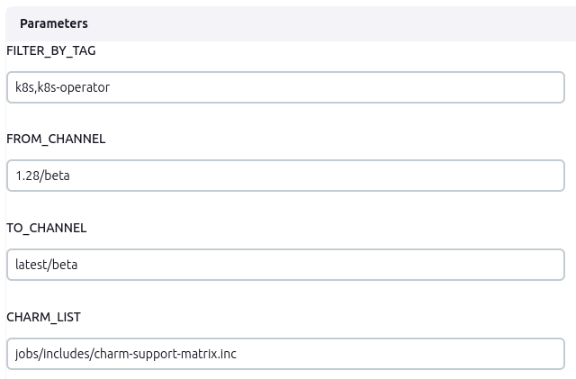
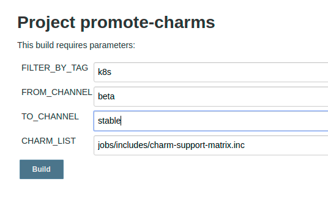
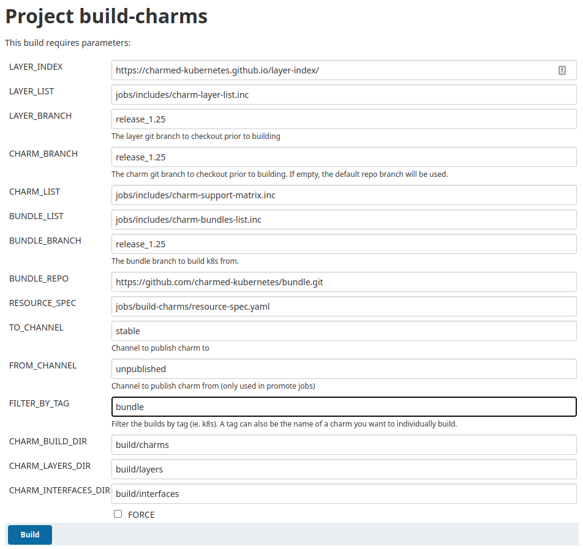
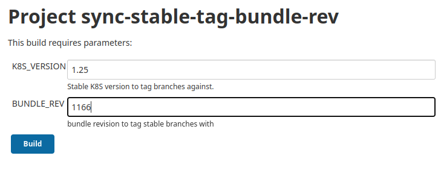

# Creating a stable release
This document outlines the process for publishing a Charmed Kubernetes stable release.

## Background

### Repository layout

All charm repositories used by Charmed Kubernetes have a common branch scheme to provide a
consistent experience across all code bases. Any external or shared repositories are forked
into the `charmed-kubernetes` github organization and have the following branches:

* `main`: The primary development branch. Merges are made against this branch as they are
  approved.
* `release_1.xx`: The release branch. Major releases have `main` directly merged to
  `release_1.xx`. Bugfix releases have specific commits cherry-picked to `release_1.xx`.

Tags are used to mark releases on the `release_1.xx` branch.

### Feature Freeze

2 weeks prior to a stable release the team goes into a feature freeze. At this
time only bugfixes and concentration on resolving any other outstanding issues
will take place for the first week of this freeze.

The remaining tasks will still be completed at the time of feature freeze giving
Solutions QA a solid base to test from.

### Conflict resolution

At the time of the feature freeze, new `release_1.xx` branches are created to match
our default repo branches per the documentation below. During the feature freeze and
Solutions QA period, fixes which need to be applied to address CI or QA failures
(and only those specific fixes) are cherry-picked to the respective release branches.

## Prepare CI

### $stable release

Once upstream has an RC for the upcoming release, our CI should stop
building pre-prelease snaps. This ensures the 1.xx track will end up
with 1.xx.0 instead of 1.xx.1-alpha.0. For example, we merged the following
between 1.29 RC and GA:

- https://github.com/charmed-kubernetes/jenkins/pull/1462

Additionally, if not done already, CI should include 1.xx in the version matrix
and config for relevant jobs. For example, see these updates where we adjusted
tests for our 1.29 release:

- https://github.com/charmed-kubernetes/jenkins/pull/1463

You now need to tell Jenkins that the jobs changed. First, get the `jjb-config.ini` from the Kubernetes BitWarden.
This file should be located in `jobs/jjb-conf.ini` and **not** checked into the repo.
Then, execute:

```sh
# wokeignore:rule=master
tox -e py -- jenkins-jobs --conf jobs/jjb-conf.ini update jobs/ci-master.yaml:jobs/*.yaml
```

## Preparing the release

### Create release branches for all repos

**Job**: https://jenkins.canonical.com/k8s-ps5/job/cut-stable-release/

We need to create `release_1.xx` branches from `main` for all
Charmed Kubernetes repositories. This will be our snapshot
from which we test, fix, and subsequently promote to the new release.

### Create tracks for charms/snaps

We do have guard-rails defined for the charms and snaps, so we don't need to request tracks anymore.
However, we still need to manually create the tracks.
For that, execute

https://github.com/charmed-kubernetes/jenkins/blob/main/bin/ensure_track --kind <charm|snap> --name <charm/snap-name> --track <track to create, e.g. 1.32>

for the charms/snaps as defined in the [charm-support-matrix](https://github.com/charmed-kubernetes/jenkins/blob/main/jobs/includes/charm-support-matrix.inc)

### Bump cdk-addons version

In [cdk-addons](https://github.com/charmed-kubernetes/cdk-addons) create a new release branch named after your release, e.g. `release-1.XX` and update the make file similar to [this PR](https://github.com/charmed-kubernetes/cdk-addons/commit/9352559d5e1822b897745b6c254c31ac0e616e33)

### Bump cdk-addons build jobs

In [build-snaps.yaml](../../../jobs/build-snaps.yaml) update the `build-release-snaps` job definition to add `1.xx` and remove `1.xx-4`. See e.g. [this PR](https://github.com/charmed-kubernetes/jenkins/pull/1610)

### Add release images to containers-image sync list

In the [bundle](https://github.com/charmed-kubernetes/bundle) repository, add a new line for the static container list similar to [this PR](https://github.com/charmed-kubernetes/bundle/commit/fcdcc54177f2514216d5aa8fb6fa3cb1ef13ebfe).
This is required for [this job](https://github.com/charmed-kubernetes/jenkins/blob/main/jobs/build-snaps/build-release-cdk-addons.groovy#L158) to build the cdk-addons and [this job](https://github.com/charmed-kubernetes/jenkins/blob/main/jobs/sync-oci-images/sync-oci-images.groovy#L266) to copy images from upstream to rocks.cc.
This `-static` field gives these to jobs an indication of some base set of static images we wish to copy from upstream to rocks.cc and to reference when building cdk-addons.

### Pin snap channel for charms in the release branches

We need to make sure that the `kubernetes-<control-plane|e2e|worker>` charms
have `1.xx/stable` set as the default snap channel. This should be done on each of
the relevant git `release_1.xx` branches. For example, for the 1.29 GA:

- https://github.com/charmed-kubernetes/charm-kubernetes-e2e/commit/b70b313a8ec983f1f32560f16ce5bcb18fd189a4
- https://github.com/charmed-kubernetes/charm-kubernetes-control-plane/pull/319
- https://github.com/charmed-kubernetes/charm-kubernetes-worker/commit/3ae4edac9632a9c6581bcfcab7fb70087c181add

> **Note**: Changes to the above repos are required as some of our customers
do not use our bundles for deployment.

### Pin snap channel for bundles in the release branches

We need to make sure that the bundle fragments have `1.xx/stable` set as the
default snap channel on the `release_1.xx` branch. For example, for the 1.29 GA:

- https://github.com/charmed-kubernetes/bundle/commit/0b12765f61e5cfc17ac1c86731819b3e600e39e1

> **Note**: Dont miss our [badges](https://github.com/charmed-kubernetes/bundle/pull/868)
like we've done so many times before!

### Build charms and bundles from the release branches

**Job**: https://jenkins.canonical.com/k8s-ps5/job/build-charms/

This job clones the `release_1.xx` branch for each of our repos. It then builds
each charm/bundle using those local repos. After building, they will be
published to the `1.xx/beta` channel in Charmhub based on the job options.

> **Note**: This job must be run again if a subsequent commit is made to the
`release_1.xx` branch of any component needed by this release.

#### Build 1.xx/beta charms and bundles



### Promote charms to latest/beta

**Job**: https://jenkins.canonical.com/k8s-ps5/job/promote-charms/

In preparation for running the **validate-charm-release-upgrade** job,
the charms must be promoted from `1.xx/beta` to `latest/beta` channels.

> **Note**: This job must be run again if any charm needed by this release
is rebuilt in the `1.xx/beta` channel.

#### Promote 1.xx/beta charms to latest/beta



### Promote new K8s snaps

**Job**: https://jenkins.canonical.com/k8s-ps5/job/build-snap-from-branch/

K8s snap promotion is handled by the `sync-snaps` job and will happen
automatically after following the `Prepare CI` section above. If for some
reason you need to manually build K8s snaps from a specific branch, use the
above job with a `branch` parameter like `1.29.0`.

The `branch` parameter gets translated to `v$branch` by
[snap.py](https://github.com/charmed-kubernetes/jenkins/blob/0b334c52b2c4f816b03ff866c44301724b8b471c/cilib/service/snap.py#L172)
which must correspond to a valid tag in our
[internal k8s mirror](https://git.launchpad.net/k8s-internal-mirror/refs/).

## Internal verification

### Run **validate-charm-release-upgrade** job

**Job**: https://jenkins.canonical.com/k8s-ps5/job/validate-charm-release-upgrade/

This validates the deployment using charms from the `latest/stable` channel,
then performing an upgrade to `latest/beta`. The tests are parameterized to
run on multiple series and with multiple snap channels.

Before running this job, confirm that the `snap_version` job parameter is set to the
appropriate channel for this release (e.g. 1.29/beta).

A successful Jenkins job run only confirms that the tests were started, **not** that they passed.
Check [Jenkaas](http://jenkaas.s3-website-us-east-1.amazonaws.com/) to ensure all tests completed successfully.
Each column represents a day. Look for the day you triggered the release tests and check if all validation tests passed in that column.

### Notify Solutions QA

At the end of the first week and assuming all major blockers are resolved, the
release is passed over to Solutions QA (SQA) for sign-off. This is done by
[publishing a CI release](https://github.com/charmed-kubernetes/jenkins/releases/new)
with a new `1.xx` tag and informing SQA of that tag. They will then have the
remaining week to test and file bugs so engineering can work towards getting
them resolved prior to GA.

Please note the [Conflict Resolution Section](#conflict-resolution) for making
any changes as a result of SQA testing.

### Azure Arc Conformance

We certify Charmed Kubernetes with the Azure Arc program by running the following
job on each new release:

https://jenkins.canonical.com/k8s-ps5/view/Conformance/job/conformance-arc-ck/

This job runs weekly, but publishing the results to Microsoft's bucket is not done
by default. Ensure we have passing results, and run the above job with the
"UPLOAD_RESULTS" parameter checked.

Credentials for this job are exported by the `azure-arc.sh` script, defined in the
"Juju Data - Azure ARC" BitWarden entry, and delivered to all Jenkins workers as part of
the `juju_creds` [credential](https://jenkins.canonical.com/k8s-ps5/manage/credentials/).

> **Note**: The `AZ_STORAGE_ACCOUNT_SAS` key expires monthly and will need to be
rotated via [the partner credential portal](https://forms.office.com/pages/responsepage.aspx?id=v4j5cvGGr0GRqy180BHbR9r2AMIPNzpPnFQdZ9IWxshUOFpaWlQ1MkdVRUpBWEtaWU1UUkZJVlA4UCQlQCN0PWcu);
use the `ARC_CANONICAL_GUID` from the BitWarden entry to get a new value.

### CNCF Conformance

**Job**: https://jenkins.canonical.com/k8s-ps5/job/conformance-cncf-ck/

Sync `charmed-kubernetes/k8s-conformance` main from upstream

- https://github.com/charmed-kubernetes/k8s-conformance

Confirm passing results, then create a PR against the upstream `k8s-conformance`
repo. For example, we used the following branch for CK 1.29:

- https://github.com/charmed-kubernetes/k8s-conformance/tree/1.29-ck

And opened this upstream PR:

- https://github.com/cncf/k8s-conformance/pull/3043

> **Note**: CNCF requires a sign-off. After confirming results, issue a
`git commit --amend --signoff` on the branch prior to submitting the PR.

## Performing the release

### Document release notes

- Bugfixes
- Enhancements
- Known Limitations/Issues

### Promote charms to stable

**Job**: https://jenkins.canonical.com/k8s-ps5/job/promote-charms/

This job takes a tag list, `from_channel`, and `to_channel`. A tag value of
`k8s` would only promote the charms that make up core `charmed-kubernetes`.
Ensure that `k8s-operator` is added to the tag list to include kubernetes
operator charms. You typically run this job multiple times to get charms into
all of the appropriate channels, for example:

- `1.27/beta` -> `1.27/stable`
- `1.27/beta` -> `latest/stable`

#### Promote 1.xx/beta charms to stable channels



### Build bundles to **beta** and **stable**

**Job**: https://jenkins.canonical.com/k8s-ps5/job/build-charms/

Bundles cannot be promoted because they reference specific channels at build
time. Therefore, it's required to build bundles which reference the <risk>
track charms and `1.xx/stable` track snaps

> **Note**: Run job two times, setting `TO_CHANNEL` as `beta` and `stable`

> **Note**: The `bundle` filter shown below ensures only bundles are built
when this job runs.

#### Build bundle Options



### Extract the release bundle to our bundle repo

For reference purposes, we extract all Charmed Kubernetes bundles to our bundle repo.
Use the
[release.sh script](https://github.com/charmed-kubernetes/bundle/blob/main/releases/release.sh)
to extract the newly built bundle to the `./releases/$track` directory and raise a PR.
For example, for the 1.29 GA:

- https://github.com/charmed-kubernetes/bundle/pull/891

### Confirm snap promotion from `1.xx/<risk>` to `latest/<risk>`

**Job**: https://jenkins.canonical.com/k8s-ps5/job/sync-snaps/

This job will automatically promote snaps to `latest`. The only prereqs are
that charms have been promoted and that the `K8S_STABLE_VERSION` enum is set
to this release `1.xx`. For example, for the 1.29 GA:

- https://github.com/charmed-kubernetes/jenkins/pull/1481

> **Note**: Nightly charm and bundle builds will publish to both `latest/edge`
and `K8S_STABLE_VERSION/edge` channels.

### Tag release branches with the current stable bundle

**Job**: https://jenkins.canonical.com/k8s-ps5/job/sync-stable-tag-bundle-rev/

For all charm repos that make up CK, tag the existing release branches with
the most recently released stable `charmed-kubernetes` bundle revision. Use
the `1.xx/stable` version number from
[charmhub.io/charmed-kubernetes](https://charmhub.io/charmed-kubernetes),
not the `latest/stable` version number.

#### Sync Stable Tag Bundle Rev Options



### Send announcement

Email announcement to k8s-crew with any relevant information.

## Post Release

When $stable++ tracks are open, add them to our CI enumerations as well as our
custom snap jobs. For example, see the additions made during our 1.29 GA to
support the future 1.28 release:

- https://github.com/charmed-kubernetes/jenkins/pull/1481

### Set cdk-addons envars

Update cdk-addons `release-1.xx` Makefile, e.g.:

- https://github.com/charmed-kubernetes/cdk-addons/commit/a05377aa2fa153fe1f815a9b82039cb769575d7f

Update cdk-addons `main` Makefile
- https://github.com/charmed-kubernetes/cdk-addons/commit/9f22ff78003f2f20d3834db623fb57dbb51e4844

### Bump snap channel to the $stable++ release

Bump the `kubernetes-<control-plane|e2e|worker>` charms and bundle
fragments in the `main` git branches to the future $stable++ release,
e.g. `1.30/edge`. You don't have to do this right away; in fact, you
should wait until you actually have snaps in the `$stable++/edge` channels
before making this change.

### Adjust LP milestones

Run the `[close|open]-milestone.py` scripts found in the
[cdk-scripts repo](https://github.com/canonical/cdk-scripts) repository.
For example:
```
./close-milestone.py 1.29
./create-milestone.py 1.29+ck1
```

# Fin
