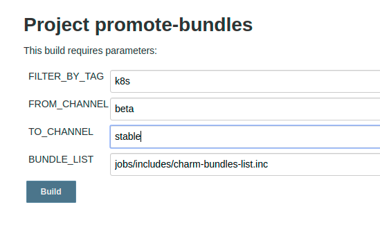

# Creating a stable release
Outlines the processes for publishing a new Charmed Kubernetes release.

## Stable Release Process

### How to read this document

Each step in the release process contains information pertaining to the
description of the jobs and what is required if needing to run the jobs
locally.

Each step should contain the following:

- Job name as seen in jenkins
- Description
- Any additional notes/caveats
- Example jenkins screenshots if necessary on the options that should be used.

### Feature Freeze

2 weeks prior to a stable release the team goes into a feature freeze. At this
time only bugfixes and concentration on resolving any other outstanding issues
will take place for the first week of this freeze.

The remaining tasks will still be completed at the time of feature freeze giving
Solutions QA a solid base to test from.

#### Conflict resolution

At the time of the feature freeze, the stable branches are git reset to match
the default branches at that point, per the documentation below. During the
feature freeze and Solutions QA period, fixes which need to be applied to
address CI or QA failures, and only those specific fixes, are cherry-picked in
to the stable branches.

## Prepare CI

### $next release

Once upstream has an RC for the next stable release, our CI should stop
building pre-prelease snaps. This ensures the 1.xx/edge channel will end up
with 1.xx.0 instead of 1.xx.1-alpha.0.

https://github.com/charmed-kubernetes/jenkins/pull/764

Additionally, if not done already, CI should be including the 1.xx/edge in the
version matrix for relevant tests. For example, see the 1.23 update where we
add n and drop n-4 from our test matrix:

https://github.com/charmed-kubernetes/jenkins/pull/761

### $next++ release

It may feel early, but part of releasing the next stable version requires
preparing for the release that will follow. This requires opening tracks and
building relevant snaps that will be used in the new 'edge' channel.

For example, we requested 1.24 tracks while preparing for the 1.23 release:

https://forum.snapcraft.io/t/kubernetes-1-24-snap-tracks/27828

We also added support for CI to build/upload to those requested tracks (k8s
snaps as well as cdk-addons):

- https://github.com/charmed-kubernetes/jenkins/pull/765/files
- https://github.com/charmed-kubernetes/jenkins/commit/b0ce1fb0053908043ce25f10cca40be6531c3156

## Preparing the release

### Tag existing stable branches with the current stable bundle

For all charm repos that make up CK, tag the existing stable branches with
the most recently released stable `cs:charmed-kubernetes` bundle revision.

**Job**: https://jenkins.canonical.com/k8s/job/sync-stable-tag-bundle-rev/

### Reset stable with master git branches

Once all repositories are tagged, we need to reset stable branches with
master. This will be our snapshot from which we test, fix, and subsequently
promote to the new stable release.

**Job**: https://jenkins.canonical.com/k8s/job/cut-stable-release/

### Submit PR's to bundle and charms to pin snap channel on the stable branches

We need to make sure that the bundle fragments and kubernetes-worker/master/e2e
are set to `<k8sver>/stable`. This should be done on each of the relevant git
`stable` branches. For example, for 1.23 GA:

- https://github.com/charmed-kubernetes/bundle/pull/815
- https://github.com/charmed-kubernetes/charm-kubernetes-e2e/pull/15
- https://github.com/charmed-kubernetes/charm-kubernetes-master/pull/192
- https://github.com/charmed-kubernetes/charm-kubernetes-worker/pull/104

> Note: The charms themselves also need to be done as some do not use our
  bundles for deployment.

### Bump snap channel to next minor release

Once the rebase has occurred we need to bump the same charms and bundle
fragments in the `master` git branches to the next k8s minor version,
e.g. `1.24/edge`. You don't have to do this right away; in fact, you
should wait until you actually have snaps in the `$next/edge` tracks
before making this change.

### Build new CK Charms from stable git branches

**Job**: https://jenkins.canonical.com/k8s/job/build-charms/

Pull down all layers and checkout their stable branches. From there build
each charm against those local branches. After the charms are built they need to be
promoted to the **beta** channel in the charmstore.

> **Note**: Beta channel is required as any bugfix releases happening at the
  same time will use the candidate channels for staging those releases.

#### Charm build options

### Promote new K8s snaps

K8s snap promotion to `beta` is handled by the `sync-snaps` job and will happen
automatically after following the `Prepare CI` section noted above. If for some
reason you need to manually build K8s snaps from a specific branch, use the
following job with a `branch` parameter like `1.23.0`:

**Job**: https://jenkins.canonical.com/k8s/job/build-snap-from-branch/

The `branch` parameter gets translated to `v$branch` by
[snap.py](https://github.com/charmed-kubernetes/jenkins/blob/0b334c52b2c4f816b03ff866c44301724b8b471c/cilib/service/snap.py#L172)
which must correspond to a valid tag in our
[internal k8s mirror](https://git.launchpad.net/k8s-internal-mirror/refs/).

> **Info**: Please note that currently **CDK-ADDONS** snap needs to be
    manually released to the appropriate channels:
    **Job**: https://jenkins.canonical.com/k8s/job/build-release-cdk-addons-amd64-1.23/

### Notify Solutions QA

At the end of the first week and assuming all major blockers are resolved, the
release is passed over to Solutions QA (SolQA) for a final sign-off. This is done
by tagging the current Jenkins commit with the release version and informing SolQA
of that taga. SolQA will then have the remaining week to test and file bugs as they
happened so engineering can work towards getting them resolved prior to going GA.

Please note the [Conflict Resolution Section](#conflict-resolution) for making
any changes as a result of their testing.

### CNCF Conformance

**Job**: https://jenkins.canonical.com/k8s/job/conformance/

### Document release notes

- Bugfixes
- Enhancements
- Known Limitations/Issues

## Performing the release

### Promote charms and bundles from **beta** to **stable**

This job takes a tag, from_channel, and to_channel. The tag defaults to `k8s` so
it will only promote the necessary charms that make up charmed-kuberneetes (the
others are kubeflow related).

**Job**: https://jenkins.canonical.com/k8s/job/promote-charms/

#### Promote charm Options

**Job**: https://jenkins.canonical.com/k8s/job/promote-bundles/

#### Promote bundle Options

### Promote snaps from <stable track>/stable to latest/<risks>

This promotion is handled by the `sync-snaps` job. Once charms and bundles
have been promoted, set the `K8S_STABLE` enum to the release semver. For
example, for 1.22 GA:

https://github.com/charmed-kubernetes/jenkins/pull/728

### Send announcement

Email announcement to k8s-crew with any relevant information.

