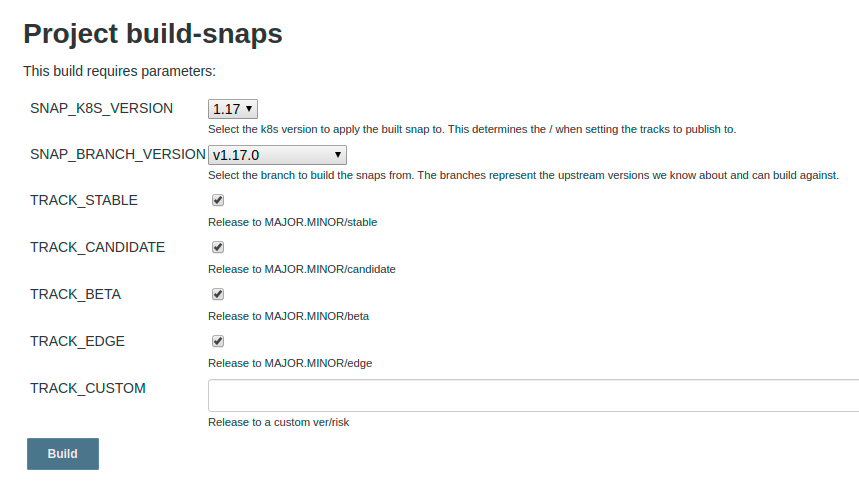
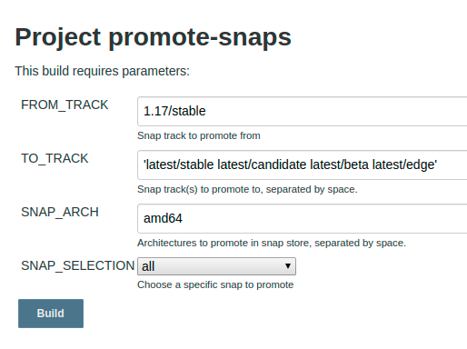

# Creating a stable release
Outlines the processes for publishing a new Charmed Kubernetes release.

## Stable Release Process

### How to read this document

Each step in the release process contains information pertaining to the
description of the jobs and what is required if needing to run the jobs
locally.

Each step should contain the following:

- Job name as seen in jenkins
- Description
- Any additional notes/caveats
- Example jenkins screenshots if necessary on the options that should be used.

### Feature Freeze

2 weeks prior to a stable release the team goes into a feature freeze. At this
time only bugfixes and concentration on resolving any other outstanding issues
will take place for the first week of this freeze.

The remaining tasks will still be completed at the time of feature freeze giving
Solutions QA a solid base to test from.

#### Conflict resolution

At the time of the feature freeze, the stable branches are git reset to match
the master branches at that point, per the documentation below. During the
feature freeze and Solutions QA period, fixes which need to be applied to
address CI or QA failures, and only those specific fixes, are cherry-picked in
to the stable branches.

## Preparing the release

### Tag existing stable branches with the current stable bundle

For all charm repos that make up CK tag the existing stable branches with
the most recently released stable bundle revision.

**Job**: https://jenkins.canonical.com/k8s/job/sync-stable-tag-bundle-rev/

### Rebase stable on top of master git branches

Once all repositories are tagged we need to rebase what's in master git on
to stable as this will be our snapshot on what we test and subsequently
promote to stable.

**Job**: https://jenkins.canonical.com/k8s/job/cut-stable-release/

### Submit PR's to bundle and charms to pin snap version on the stable branches

We need to make sure that the bundle fragments and kubernetes-worker/master/e2e
are set to `<k8sver>/stable` prior to cutting a new release. This should be done
on each of the relevant git stable branches

> Note: The charms themselves also need to be done as some do not use our
  bundles for deployment.

### Bump snap version to next minor release

Once the rebase has occurred we need to bump the charms and bundle fragments
to the next k8s minor version in the master git branches, ie 1.21/edge.

### Build new CK Charms from stable git branches

**Job**: https://jenkins.canonical.com/k8s/job/build-charms/

Pull down all layers and checkout their stable branches. From there build
each charm against those local branches. After the charms are built they need to be
promoted to the **beta** channel in the charmstore.

>-
  **Note**: Beta channel is required as any bugfix releases happening at the
  same time will use the candidate channels for staging those releases.

#### Charm build options

### Promote new K8S snaps

Promote new K8S snaps for the upcoming stable release to the beta and
candidate channels of the snapstore.

> **Info**: Please note that currently **CDK-ADDONS** snap needs to be
    manually promoted to the appropriate channels:
    **Job**: https://jenkins.canonical.com/k8s/job/build-release-cdk-addons-amd64-1.22/

#### Snap build options

### Notify Solutions QA

At the end of the first week and assuming all major blockers are resolved, the
release is passed over to Solutions QA (SolQA) for a final sign-off. SolQA will
then have the remaining week to test and file bugs as they happened so
engineering can work towards getting them resolved prior to going GA.

Please note the [Conflict Resolution Section](#conflict-resolution) for making
any changes as a result of their testing.

### CNCF Conformance

**Job**: https://jenkins.canonical.com/k8s/job/conformance/

### Document release notes

- Bugfixes
- Enhancements
- Known Limitations/Issues

## Performing the release

### Promote charms and bundles from **beta** to **stable**

This job takes a tag, from_channel, and to_channel. The tag defaults to `k8s` so
it will only promote the necessary charms that make up charmed-kuberneetes (the
others are kubeflow related).

**Job**: https://jenkins.canonical.com/k8s/job/promote-charms/

#### Promote charm Options

**Job**: https://jenkins.canonical.com/k8s/job/promote-bundles/

#### Promote bundle Options

### Promote snaps from <stable track>/stable to latest/<risks>

Once complete, the next stable release needs to be promoted into the
**latest/<risks>** tracks as the default version for snap installs.

**Job**: https://jenkins.canonical.com/k8s/job/promote-snaps/

#### Options

### Send announcement

Email announcement to k8s-crew with any relevant information.

### Update ck bundle repo references

Update ck bundle repo to match the current stable snap release and point the
latest to the next minor version.

For example, if 1.17 is the upcoming release, then once CK is released we
need to update the bundle repo stable branch to reflect 1.17/stable. Also,
update the master branch to point to the next K8S release, in this case
1.18/edge.

