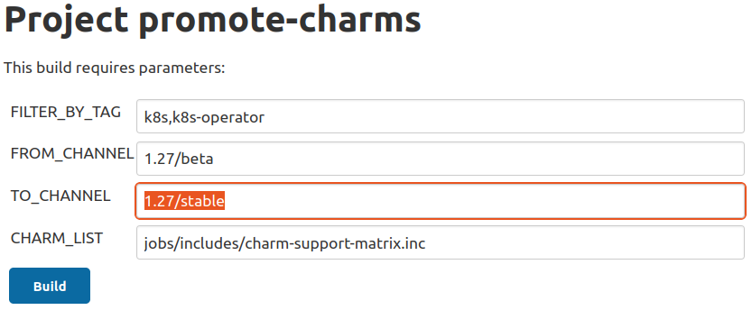
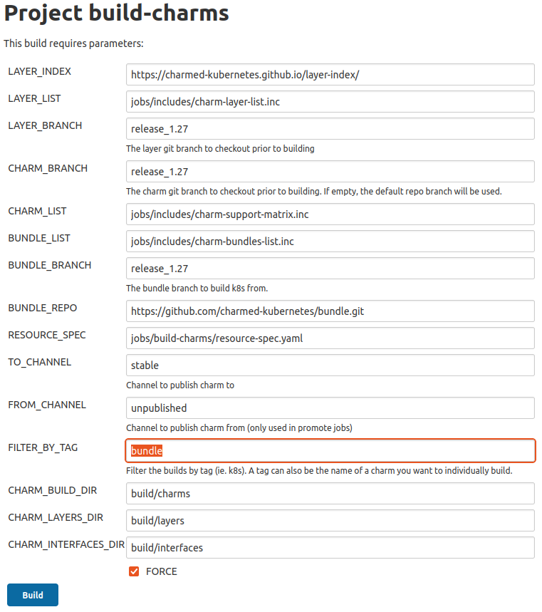
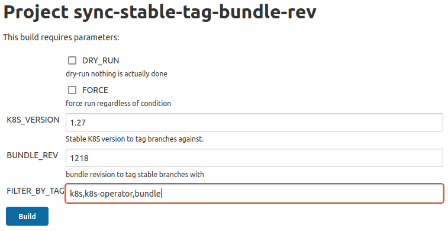

# Creating a stable release
Outlines the processes for publishing a new Charmed Kubernetes release.

## Stable Release Process

### How to read this document

Each step in the release process contains information pertaining to the
description of the jobs and what is required if needing to run the jobs
locally.

Each step should contain the following:

- Job name as seen in jenkins (where applicable)
- Description
- Any additional notes/caveats
- Example jenkins screenshots if necessary on the options that should be used.

### Feature Freeze

2 weeks prior to a stable release the team goes into a feature freeze. At this
time only bugfixes and concentration on resolving any other outstanding issues
will take place for the first week of this freeze.

The remaining tasks will still be completed at the time of feature freeze giving
Solutions QA a solid base to test from.

#### Conflict resolution

At the time of the feature freeze, the release branches are git reset to match
the default branches at that point, per the documentation below. During the
feature freeze and Solutions QA period, fixes which need to be applied to
address CI or QA failures, and only those specific fixes, are cherry-picked in
to the respective release branches.

## Prepare CI

### $next release

If not done already, add the upcoming release to the CI enumerations
as well as our custom snap jobs. For example, see the additions made
for the 1.25 release:

- https://github.com/charmed-kubernetes/jenkins/pull/974
- https://github.com/charmed-kubernetes/jenkins/commit/2416d9e98f9f9c6b26b5b94215c43650a9b241e4

> **Note**: Nightly charm and bundle builds will target both
`latest/edge` and `$next/edge` channels.

Once upstream has an RC for the upcoming release, our CI should stop
building pre-prelease snaps. This ensures the 1.xx track will end up
with 1.xx.0 instead of 1.xx.1-alpha.0. For example:

- https://github.com/charmed-kubernetes/jenkins/pull/991

Additionally, if not done already, CI should include 1.xx in the version matrix
and config for relevant jobs. For example, see these updates where we adjusted
tests for our 1.25 release:

- https://github.com/charmed-kubernetes/jenkins/pull/997
- https://github.com/charmed-kubernetes/jenkins/pull/1005

### $next++ release

It may feel early, but part of releasing the next stable version requires
preparing for the release that will follow. This requires opening tracks and
building relevant snaps and charms that will be used in the new `edge` channel.

For example, we requested 1.26 snap tracks while preparing for the 1.25 release:

- https://forum.snapcraft.io/t/kubernetes-1-26-snap-tracks/31491

Charm track requests are made by contacting
[~snapstore](https://chat.canonical.com/canonical/channels/snapstore)
and asking for new tracks to be opened for every neccessary
[charm](https://charmhub.io/charm) and [bundle](https://charmhub.io/bundle)
owned by `Canonical Kubernetes` on [charmhub.io](https://charmhub.io). For example:

- https://chat.canonical.com/canonical/pl/mbyp1gkfrtryube18pti7dsray

## Preparing the release

### Create release branches for all repos

**Job**: https://jenkins.canonical.com/k8s/job/cut-stable-release/

We need to create `release_1.xx` branches from `main` for all
Charmed Kubernetes repositories. This will be our snapshot
from which we test, fix, and subsequently promote to the new release.

### Pin snap channel on bundles/charms in the release branches

We need to make sure that the bundle fragments and kubernetes-worker/control-plane/e2e
have `1.xx/stable` set as the default snap channel. This should be done on each of
the relevant git `release_1.xx` branches. For example, for the 1.25 GA:

- https://github.com/charmed-kubernetes/bundle/pull/858
- https://github.com/charmed-kubernetes/charm-kubernetes-e2e/pull/24
- https://github.com/charmed-kubernetes/charm-kubernetes-control-plane/pull/243
- https://github.com/charmed-kubernetes/charm-kubernetes-worker/pull/129

> **Note**: Changes to the above charms are required as some of our customers
do not use our bundles for deployment.

### Bump snap channel to next minor release

Once the rebase has occurred we need to bump the same charms and bundle
fragments in the `main` git branches to the next k8s minor version,
e.g. `1.26/edge`. You don't have to do this right away; in fact, you
should wait until you actually have snaps in the `$next++/edge` channels
before making this change.

### Build new CK Charms from release git branches

**Job**: https://jenkins.canonical.com/k8s/job/build-charms/

This job clones the `release_1.xx` branch for each of our repos. It then builds
each charm using those local repos. After the charms are built, they will
be promoted to the `beta` channel in Charmhub based on the build options
shown below.

> **Note**: The `beta` channel is required as any bugfix release happening at
the same time will use the `candidate` channel for staging.

#### Charm build options

### Promote new K8s snaps

**Job**: https://jenkins.canonical.com/k8s/job/build-snap-from-branch/

K8s snap promotion is handled by the `sync-snaps` job and will happen
automatically after following the `Prepare CI` section above. If for some
reason you need to manually build K8s snaps from a specific branch, use the
above job with a `branch` parameter like `1.25.0`.

The `branch` parameter gets translated to `v$branch` by
[snap.py](https://github.com/charmed-kubernetes/jenkins/blob/0b334c52b2c4f816b03ff866c44301724b8b471c/cilib/service/snap.py#L172)
which must correspond to a valid tag in our
[internal k8s mirror](https://git.launchpad.net/k8s-internal-mirror/refs/).

> **Note**: Currently, the **CDK-ADDONS** snap needs to be manually built for
> the appropriate channels:
> - https://jenkins.canonical.com/k8s/job/build-release-cdk-addons-1.25/

### Notify Solutions QA

At the end of the first week and assuming all major blockers are resolved, the
release is passed over to Solutions QA (SolQA) for a final sign-off. This is done
by tagging the current Jenkins commit with the release version and informing SolQA
of that tag. SolQA will then have the remaining week to test and file bugs as they
happen so engineering can work towards getting them resolved prior to GA.

Please note the [Conflict Resolution Section](#conflict-resolution) for making
any changes as a result of SolQA testing.

### CNCF Conformance

**Job**: https://jenkins.canonical.com/k8s/job/conformance/

### Document release notes

- Bugfixes
- Enhancements
- Known Limitations/Issues

## Performing the release

### Promote charms from **beta** to **stable**

**Job**: https://jenkins.canonical.com/k8s/job/promote-charms/

This job takes a tag, from_channel, and to_channel. The tag defaults to `k8s` so
it will only promote the necessary charms that make up charmed-kubernetes (the
others are kubeflow related).

#### Promote charm Options

### Build bundles to **stable**

Bundles cannot be promoted because they reference specific charm channels at
build time. Therefore, it's required to build bundles which reference the
stable charm channels.

> **Note**: The `bundle` filter shown below ensures only bundles are built
when this job runs.

#### Build bundle Options

### Tag release branches with the current stable bundle

**Job**: https://jenkins.canonical.com/k8s/job/sync-stable-tag-bundle-rev/

For all charm repos that make up CK, tag the existing release branches with
the most recently released stable `charmed-kubernetes` bundle revision. Use
the `1.xx/stable` version number from
[charmhub.io/charmed-kubernetes](https://charmhub.io/charmed-kubernetes),
not the `latest/stable` version number.

#### Sync Stable Tag Bundle Rev Options

### Promote snaps from `1.xx/stable` to `latest/<risks>`

**Job**: https://jenkins.canonical.com/k8s/job/sync-snaps/

This job will automatically promote snaps to `latest`. The only
prereqs are that charms and bundles have been promoted, and that
the `K8S_STABLE` enum is set to this release `1.xx`. For example,
for the 1.24 GA:

- https://github.com/charmed-kubernetes/jenkins/pull/902/files

### Send announcement

Email announcement to k8s-crew with any relevant information.

